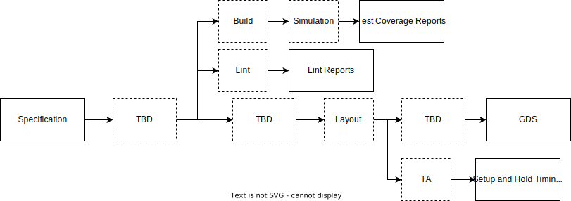
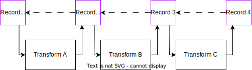

EDA flows are unique in the number of stacked layers of transformation that are applied to the inputs to generate the desired result, and in the number of artefacts that are ultimately produced.

## Axioms

There are three axioms that a capable flow must exhibit:

 1. Reproducibility - for any given set of inputs the same result must be produced every time the flow is run;
 2. Traceability - for any given output the inputs and the transformations applied to those inputs must be precisely known;
 3. Modularity - any given set of transformations must be able to adapt to the inputs, tools, and resources that are available and produce an equivalent result.

The motivation for the first and second axioms stems from the inherent level of risk in designing silicon chips. A tape-out is an incredibly expensive operation and many companies simply do not have the resources to discover a failure during bring-up. While the flow can never eliminate the risk alone, it can form a foundation of confidence that a given deliverable has passed all of the quality assurance checks that a team defines. Ensuring that each output is reproducible and traceable means that the final delivery can be made with complete confidence in where the result has come from and what operations have been performed on it.

The motivation for the third axiom is a little different - it is an acknowledgement that competition exists in the EDA space, not only between commercial vendors but also with the open source ecosystem. With this in mind, being able to describe transformations in generic ways that abstract the interface of any given tool allows the user to move between equivalent offerings from different vendors with confidence and relative ease. If a flow is designed to reflect the behaviours of a given vendor's tools, then the level of pain felt to move to an alternate vendor can be very high. This can put a team on the back foot when it comes to negotiating contracts or choosing whether to investigate or adopt a new product.

## Build a bridge, not a pier

An important consideration is understand where the flow starts and where it must end. For some teams the end goal will be a GDS prepared for manufacture, for others this may be an FPGA bitstream, or simply a well tested RTL deliverable ready to be implemented by a customer within a larger SoC. Sensible decisions on how a flow is structured can only be made if this entire pathway is considered, as it dictates not only the necessary transformations but the hand-off point between different parts of a team.

### Identify the anchors

In this example we will define our anchor points as starting from the specification, which is a prose description of the chip to be produced, and finishing with the GDS, a file used to hand-off to a manufacturer like TSMC. It may be tempting to build a flow step-by-step as the team's needs demand, with the hope that making sensible decisions at each step leads to a good result. However in reality making decisions without considering the end goal is unlikely to lead to a seamless approach, and shifts technical debt to a point late in a project's timeline. This shortcoming is often addressed with hacked about scripts, but this will likely result in many problems in due course.

This is not to say that a perfect flow has to be built day one, as this is very unrealistic, but it does suggest that the process of adding a stage into a flow needs to be quick and easy and that any one stage does not force a particular assumption on later stages.

{ width="100%" }

### Identify secondary outputs

While GDS or a bit stream may be the ultimate result of the process that gets sent to manufacture, it will likely be supported by a number of secondary outputs that are just as important but do not continue on to production. For example test passes and failures, coverage statistics, and CDC reports are all important indicators of the quality-of-result of the primary outputs. Such artefacts will be critical when deciding if a given design is mature enough to send into production. Understanding when and where these results are produced is very important when gathering data from each run.

This process will likely define the rough shape of operations that will need to happen in the flow, but these should be kept as generalised as possible at this stage. The example below identifies important secondary artefacts such as lint reports, test coverage, and setup/hold timing analysis. These artefacts are produced at different points between the anchors of 'specification' and 'GDS', and suggest a certain order of stages. However, it is important to leave room for extra stages to be slotted in at any stage in the future.

{ width="100%" }

### Fill out the skeleton

With the start and end points defined, along with all of the important outputs identified, the skeleton can now be filled out to identify all of the stages. As some guidance is given by the anchor points and required outputs, the fine detail does not be defined upfront - in fact for many teams this will likely be an incremental process as a later flow stages are not required before a design has reached sufficient maturity. However planning is the key, and keeping an eye on the required deliverables is essential.

## Existing options

### Build systems

When companies come to implement schemes for managing and running the various transformations, they tend to adopt standard build tools such as the Free Software Foundation's Make or Google's Bazel and possibly with some form of custom layer sitting atop that manages it. While different tools offer different benefits, there are some drawbacks to these 'off-the-shelf' solutions:

 1. Constructing deep transformation pipelines is not what they are intended for - they work well for steps of compiling C to an object, linking to form a library, and then an executable, but this falls far short of the complexity in a typical silicon design flow;
 2. Lacking natural support for the level of complexity in an ASIC - where many tens or hundreds of different IPs need to be incrementally assembled into increasingly complex subsystems;
 3. Inability to support multiple 'views' of the same block - as transformations are applied the outputs may entirely replace earlier 'views' of the design - for example RTL, netlist, and post-layout netlist can all be different views of the same design, which can all be consumed through simulation.

These build systems also aren't aware of the nature of the artefacts produced during the build process. Silicon artefacts can be typically much larger (not infrequently gigabytes in size) than those familiar to the software industry (a few 10s or 100s megabytes, but frequently much smaller).

### Data engineering pipelines

Taking a very different view of the problem with large artefacts and pipelines of transformations, there is a similarity to processes commonly found in data engineering. In this industry, very large data sets are analysed for patterns with outputs feeding into further analysis steps that produce a variety of reports and results. At a high level, this sounds very similar to the problems seen in modern large-scale IP and ASIC design - possibly a closer fit than the build systems just discussed.

[Apache Airflow](https://airflow.apache.org), [Spotify's Luigi](https://github.com/spotify/luigi), and [Lyft's Flyte](https://flyte.org) are just some of the many options for this. These tools are designed to drive data analytics and machine learning stacks, have rich syntaxes for describing pipeline operations, and are freely available.

These tools are not a perfect fit to the task either - they are primarily designed to support workflows primarily in Python, focussed on analytics and ML, and based around queries. They generally expect to scheduling regular analysis operations, rather than support interactive build pipelines. Scheduling and job distribution is managed by the tool itself, and won't work with the typical grid schedulers that silicon companies are familiar with and many tools require - making them more difficult to deploy.

However, their methods of declaring transformations and pipelines could be a source of great inspiration.

## Build pipelines

An 'ideal' system needs to inherit traits from both build systems and data pipelines - i.e. the ability to predominantly use third-party tools to perform transforms, while carrying artefacts between many different stages. The system will need to assemble and execute a directed acyclic graph (DAG), understanding exactly which operations need to precede others and what inputs and outputs are required and expected.

However, such a system needs to be aware of the constraints of a typical silicon design environment - for example:

 1. A grid scheduler such as SGE, AGE, or Slurm will typically be in use;
 2. Tools consume licenses that are generally in limited supply relative to the number of jobs to run;
 3. Artefacts are very large and so copying them around needs to be avoided if possible;
 4. Wide mix of different languages and tools may be in use.

It's important to realise that the problem does not need to be addressed by a single tool, and in fact forming clear distinctions in role could be very helpful in forming a more flexible solution.

For example, the roles of orchestrating the build and simulation of a design can be made distinct from the details of launching and monitoring the steps which support each pipeline stage. In this case, the orchestrator would be 'domain' aware - i.e. it understands filelists, defines, and other inputs to a typical Verilog elaboration step and can convert those into calls to tools such as Synopsys VCS or Cadence Xcelium. A job runner then accepts the lists of tasks to run, and launches those onto whatever compute cluster is available, reporting back once the workload is complete. This approach is particularly beneficial should a team ever need to move from one compute solution to another, or it operates across a variety of solutions (for example a mixed environment where some tasks can be run on a user's local machine, while others are dispatched to a compute farm).

### Job runner

The role of the job runner is to abstract the details of the underlying compute solution - this could be a single machine, a grid engine, or a Kubernetes cluster. In some environments there may be a hybrid compute solution, with different phases of the project being executed on different types of infrastructure - for example an individual engineer may test a design change on their local machine running a small number of tests, but then push the change to a review system where it is automatically tested against a much wider suite of tests. This detail should be managed by the job runner, and hidden from the higher layers.

At a very minimum a job runner will need to:

 * Execute single, grouped, and arrayed jobs with the possibility to nest group and array structures within each other to allow for logical groupings to be described;
 * Propagate a managed environment down to each job that is executed so that executions are reproducible (provided that the invoked tool produces the same result given the same inputs);
 * Support explicit ordering between jobs so that dependencies can be formed where one job requires the result of another, or can clean up in the event of a failure;
 * Capture messages from each job that runs in a way that can be retrieved for manual inspection should something go wrong;
 * Allow artefacts to be passed between jobs so that outputs of one job can form the input to another.

[Gator](http://github.com/intuity/gator) attempts to implement these requirements in a way that can either be used as a standalone tool or as a library within a larger system.

### Orchestrator

The role of the orchestrator is to sequence the different transformations, trace artefacts produced by each, and support tasks being launched through the job runner. It does not necessarily need to be domain specific, but it does to work with the constraints discussed in earlier sections.

#### Transforms & Records

{ width="100%" }

The orchestrator should contain tool specific behaviours within transforms - records passing between different transforms should not be inherently tool specific, although they may carries 'variants' of artefact that can only be consumed by certain other transforms. For example, one type of transformation may be a design build step which can be implemented using Synopsys VCS, or Cadence Xcelium, or Verilator. The build transform will always produce some form of binary which executes the simulation, but different implementations will produce tool-specific versions of this binary. A generic downstream simulation transform may again be implemented using VCS, Xcelium, or Verilator and will therefore need to operate on the binary type produced by the corresponding build stage. However, the record passing between the transforms can still identify in a common format where the supporting binary is stored with an annotation to specify which 'variant' it is.

Each transform will need to contain three parts:

 1. Input specialisation - where the generic record passed into the transform is converted to match the tool;
 2. Execution - where the tool is invoked;
 3. Output normalisation - where the result produced by the tool is converted back into a generic record ready to be passed downstream.

The execution step may have different behaviours depending on the type of transform, or the mode the flow is being run in, for example:

 * Under 'regression' mode a simulation step will execute in batch mode without capturing waves;
 * In 'debug' mode the same step still execute in batch mode, but will capture full waveforms;
 * In 'interactive' mode the step will instead invoke the interactive GUI and allow the user to perform analysis.

In each case the same specialisation and normalisation steps surround the execution step, but the exact nature of the execution will vary depending on the mode. It will be up to the implementation of the transform to handle this.

It's important to realise that some execution stages may not be automatic. For example, some physical design processes such as layout may require hand placement and routing by a skilled engineer. These workflows should still be supported within this framework, and supported by the specialisation and normalisation steps.

The records passed between different transforms track the progress of a design as it evolves, including all of the inputs consumed and outputs produced. To support the 'reproducible' and 'traceable' axioms, these records should:

 * Be serialisable and de-serialisable - allowing them to be written to disk or other storage mechanism, allowing a workflow to resume from any saved 'checkpoint';
 * Reference their ancestors - allowing the evolution of the design to be tracked, meaning that the final result can be traced back to its roots.

#### Syntaxes

There will be a need for multiple syntaxes:

 * Input - describe primary inputs to any given workflow;
 * Transform - detail the implementation including all specialisation and normalisation steps;
 * Record - carry the serialisable/de-serialisable data between transforms;
 * Orchestration - link together different transforms in specific workflows.

#### Scenarios to consider

Some important scenarios to consider:

 1. How to handle 3rd party and encrypted IPs - this may place constraints on how RTL can be handled;
 2. How soft models, RTL, and netlist can substitute for each other in simulation stages;
 3. How contents of a ROM may be delivered - a task that can create a parallel thread to most other operations;
 4. How divergent (1-to-N) and convergent (N-to-1) transforms can be supported;
 5. Monolithic vs modular transforms - some artefacts may be reusable when building the next layer of hierarchy, while other operations may require the process to run on the hierarchy as a whole.

## References

 * Bazel Rules HDL - [repository](https://github.com/hdl/bazel_rules_hdl) - [presentation at WOSET 2021](https://woset-workshop.github.io/WOSET2021.html#article-16)
